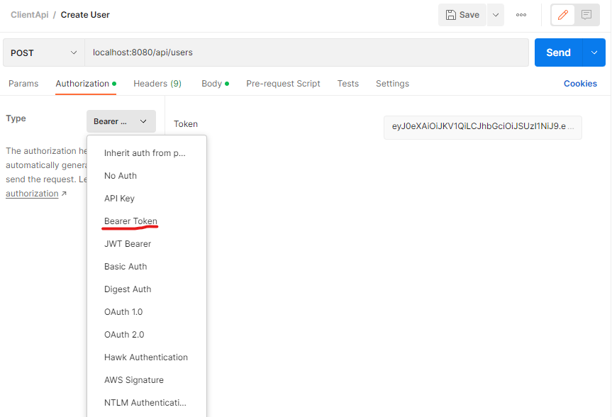

# Client/User Basic API using a Docker Symfony 5 starter kit 

This development stack includes Symfony 5/Webpack Encore, MySQL, Apache and PHP built with Docker containers using docker-compose tool.

## Services

- MySQL 8.0
- Apache
- PHP7-FPM 7.4

## Installation
1. Clone the repository, build services and create/Start containers:
```sh
$ git clone https://github.com/gianruta28/client-api.git
$ cd docker-symfony-5
$ docker-compose build
$ docker-compose up -d
```

2. Visit http://127.0.0.1:8080/


## Folders structure

```text
docker-symfony-5/
├─ .doc/
├─ .docker/
│ ├─ apache/
│ │   ├─ config/
│ │   └─ Dockerfile
│ ├─ mysql/
│ │   └─ config/
│ └─ php/
│     ├─ config/
│     │    └─ docker-entrypoint.sh
│     └─ Dockerfile
│ ...
│ ├─ .env
│ └─ docker-compose.yml
```

- .doc : documentation for this repository (images etc.), you can skip it completely
- .docker : folder containing Dockerfiles and additional information to run containers. Here is also stored the data of mounted service VOLUME (database files, logs etc.).
- .env : Symfony 5/Docker configuration file - feel free to change regarding your needs
- .docker-compose.yml : definition of multi-container Docker application


## Troubleshooting
> Environment: WINDOWS 10
> Error: Windows Docker Error - standard_init_linux.go:211: exec user process caused "no such file or directory"
> Solution: Error link to CLRF EOL created after repo is pulled. In case of issue, please change the EOL from CRLF to LF in following files.
> (you can use Notepad++ and its option find/replace - \r\n to \n)
```sh
$ cd docker-symfony-5/.docker/php/config/
$ docker-symfony-5/.docker/php/config/Dockerfile
$ docker-symfony-5/.docker/php/config/docker-entrypoint.sh
```

## Commands

```sh
# Docker
$ docker-compose up -d
$ docker-compose down
$ docker-compose up -d --no-deps --build mysql
$ docker-compose up -d --no-deps --build apache
$ docker-compose up -d --no-deps --build php
$ docker-compose exec php sh

# Symfony
$ docker-compose exec php php bin/console cache:clear

# Composer
$ docker-compose exec php composer install
```

## Other
In this starter, you can enable or disabled the insertion of data fixtures everytime the container starts.
This is enabled by default. To disable it edit the docker/php/config/docker-entrypoint.sh file like this


```sh
....
if [ "$APP_ENV" != 'prod' ]; then
		composer install --prefer-dist --no-interaction --optimize-autoloader

    # Deleting and Creating db for insertion of data every time the container starts.
    # Comment section to avoid this behavior
    # Droping actual db and creating a new one
    # php bin/console doc:database:drop --force
    # php bin/console doc:database:create
    # php bin/console --no-interaction doctrine:migrations:migrate
    # php bin/console  doctrine:fixtures:load --no-interaction
fi
....
```
### Postman Collection
The repository includes a postman collection JSON (ClientApi.postman_collection.json). This file imported in Postman has some requests prepared and to try the API. Since JWT is used for authentication you will need to set the JWT as following in the Postman Request (after receiving it from login request)



In Authorization tab. Select Type Bearer Token and paste the JWT token received from login response

## Notice
Stack was configured for developments purposes. Please do not consider deploying it on production as is, without previous review.
